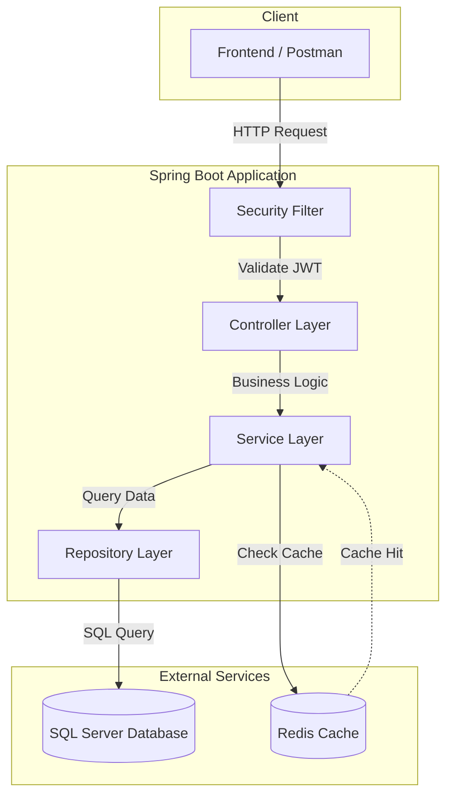
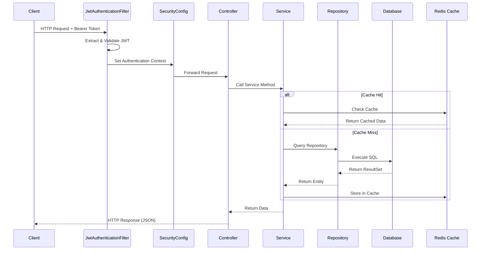
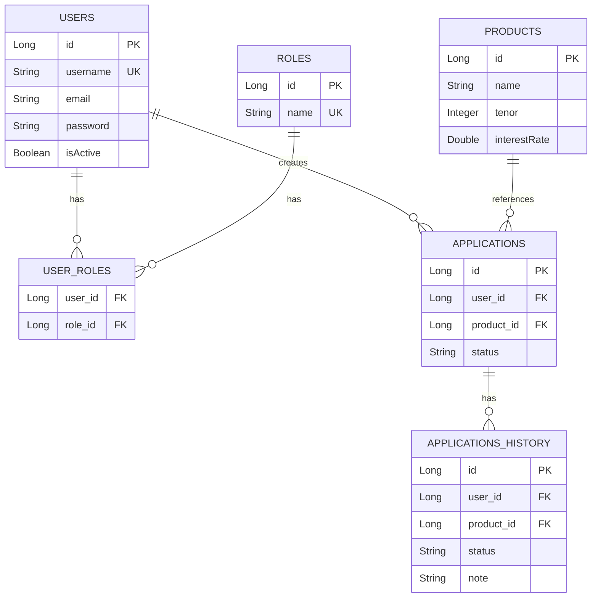
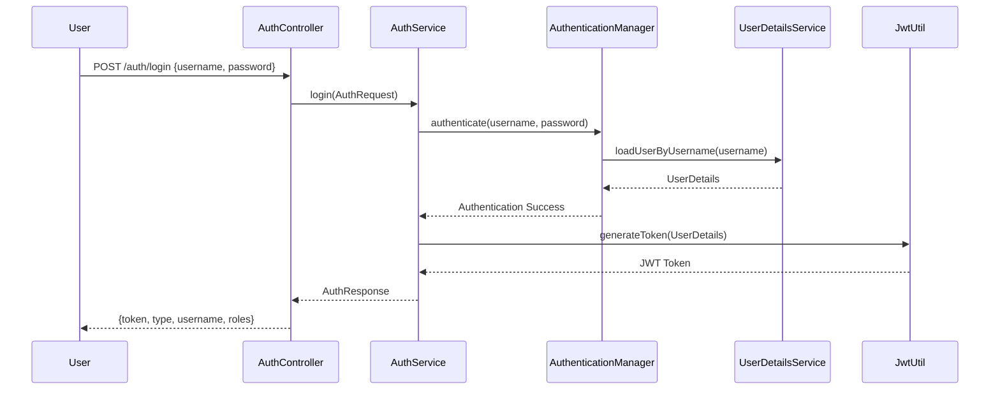
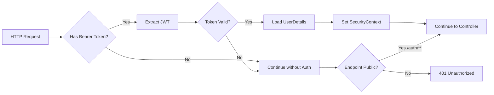

# 📚 Spring Tutor - Project Architecture & Tutorial

Dokumentasi lengkap untuk proyek **Spring Tutor** - REST API dengan Spring Boot 4.0, JWT Authentication, dan Redis Caching.

---

## 📋 Daftar Isi

1. [Overview](#overview)
2. [Tech Stack](#tech-stack)
3. [Arsitektur Aplikasi](#arsitektur-aplikasi)
4. [Struktur Folder](#struktur-folder)
5. [Entity & Database Schema](#entity--database-schema)
6. [Authentication Flow (JWT)](#authentication-flow-jwt)
7. [Caching dengan Redis](#caching-dengan-redis)
8. [API Endpoints](#api-endpoints)
9. [Penjelasan Tiap Layer](#penjelasan-tiap-layer)
10. [Cara Menjalankan](#cara-menjalankan)

---

## Overview

**Spring Tutor** adalah proyek pembelajaran REST API menggunakan Spring Boot dengan fitur:

- ✅ **JWT Authentication** - Stateless authentication dengan JSON Web Token
- ✅ **Role-Based Access Control** - User dan Admin roles
- ✅ **Redis Caching** - Caching untuk optimasi performa
- ✅ **SQL Server Database** - Microsoft SQL Server sebagai database
- ✅ **Standar API Response** - Konsisten response format

---

## Tech Stack

| Komponen   | Teknologi             | Versi  |
| ---------- | --------------------- | ------ |
| Framework  | Spring Boot           | 4.0.0  |
| Java       | OpenJDK               | 21     |
| Database   | SQL Server            | 2022   |
| Cache      | Redis                 | Latest |
| Security   | Spring Security + JWT | 6.x    |
| ORM        | Hibernate/JPA         | -      |
| Build Tool | Maven                 | -      |

### Dependencies (pom.xml)

```xml
<!-- Core -->
spring-boot-starter-data-jpa
spring-boot-starter-web
spring-boot-starter-security

<!-- Database -->
mssql-jdbc

<!-- JWT -->
jjwt-api (0.12.6)
jjwt-impl
jjwt-jackson

<!-- Caching -->
spring-boot-starter-data-redis
spring-boot-starter-cache

<!-- Utility -->
lombok
```

---

## Arsitektur Aplikasi

### High-Level Architecture



### Request Flow Diagram



---

## Struktur Folder

```
spring-tutor/
├── src/main/java/com/gvn/springtutor/
│   ├── SpringTutorApplication.java    # Main entry point
│   │
│   ├── base/                           # Base classes
│   │   └── ApiResponse.java            # Generic API response wrapper
│   │
│   ├── config/                         # Configuration classes
│   │   ├── DataInitializer.java        # Seed data saat startup
│   │   └── RedisConfig.java            # Redis cache configuration
│   │
│   ├── controller/                     # REST Controllers
│   │   ├── AuthController.java         # Login & Register endpoints
│   │   ├── ProductController.java      # Product CRUD
│   │   ├── RoleController.java         # Role CRUD
│   │   └── UserController.java         # User CRUD
│   │
│   ├── dto/                            # Data Transfer Objects
│   │   ├── AuthRequest.java            # Login request body
│   │   ├── AuthResponse.java           # Login response body
│   │   └── RegisterRequest.java        # Register request body
│   │
│   ├── entity/                         # JPA Entities
│   │   ├── Applications.java           # Loan application
│   │   ├── ApplicationsHistory.java    # Application history
│   │   ├── Product.java                # Loan product
│   │   ├── Role.java                   # User role
│   │   └── User.java                   # User account
│   │
│   ├── repository/                     # Spring Data JPA Repositories
│   │   ├── ProductRepository.java
│   │   ├── RoleRepository.java
│   │   └── UserRepository.java
│   │
│   ├── security/                       # Security components
│   │   ├── CustomUserDetailsService.java  # Load user from DB
│   │   ├── JwtAuthenticationFilter.java   # JWT filter
│   │   ├── JwtUtil.java                   # JWT utility
│   │   └── SecurityConfig.java            # Security configuration
│   │
│   ├── service/                        # Business logic layer
│   │   ├── AuthService.java            # Authentication logic
│   │   ├── ProductService.java         # Product business logic
│   │   ├── RoleService.java            # Role business logic
│   │   └── UserService.java            # User business logic
│   │
│   └── util/                           # Utility classes
│       └── ResponseUtil.java           # Response builder helper
│
└── src/main/resources/
    └── application.yml                 # Application configuration
```

---

## Entity & Database Schema

### Entity Relationship Diagram



### Entity Details

#### 1. User Entity

```java
@Entity
@Table(name = "users")
public class User implements Serializable {
    @Id @GeneratedValue(strategy = GenerationType.IDENTITY)
    private Long id;

    @Column(unique = true, nullable = false)
    private String username;

    private String email;
    private String password;      // BCrypt encoded
    private Boolean isActive;

    @ManyToMany(fetch = FetchType.EAGER)
    @JoinTable(name = "user_roles")
    private Set<Role> roles;      // Relasi ke Role
}
```

#### 2. Role Entity

```java
@Entity
@Table(name = "roles")
public class Role implements Serializable {
    @Id @GeneratedValue(strategy = GenerationType.IDENTITY)
    private Long id;

    @Column(unique = true, nullable = false)
    private String name;          // "ADMIN", "USER"
}
```

#### 3. Product Entity

```java
@Entity
@Table(name = "products")
public class Product implements Serializable {
    @Id @GeneratedValue(strategy = GenerationType.IDENTITY)
    private Long id;

    private String name;          // "Bronze", "Silver", "Gold"
    private Integer tenor;        // 12, 24, 36 bulan
    private Double interestRate;  // 5.0%, 7.0%, 9.0%
}
```

---

## Authentication Flow (JWT)

### Login Flow



### JWT Token Structure

```
Header.Payload.Signature

eyJhbGciOiJIUzI1NiJ9.           # Header (Algorithm: HS256)
eyJzdWIiOiJhZG1pbiIsImlhdCI6...  # Payload (Claims)
SflKxwRJSMeKKF2QT4fwpMeJf36POk6yJV  # Signature
```

**Payload Claims:**

- `sub`: Username
- `roles`: User roles (ROLE_ADMIN, ROLE_USER)
- `iat`: Issued at timestamp
- `exp`: Expiration timestamp (24 jam)

### Security Filter Chain



### Security Configuration

```java
@Configuration
@EnableWebSecurity
public class SecurityConfig {

    @Bean
    public SecurityFilterChain securityFilterChain(HttpSecurity http) {
        http
            .csrf(AbstractHttpConfigurer::disable)      // Disable CSRF
            .authorizeHttpRequests(auth -> auth
                .requestMatchers("/auth/**").permitAll() // Public endpoints
                .anyRequest().authenticated())           // Protected endpoints
            .sessionManagement(session -> session
                .sessionCreationPolicy(SessionCreationPolicy.STATELESS))
            .addFilterBefore(jwtAuthFilter, UsernamePasswordAuthenticationFilter.class);

        return http.build();
    }
}
```

---

## Caching dengan Redis

### Cache Architecture

```mermaid
flowchart TB
    subgraph "Service Layer"
        A[getAllProducts]
        B[createProduct]
    end

    subgraph "Redis Cache"
        C[(products::allProducts)]
    end

    subgraph "Database"
        D[(SQL Server)]
    end

    A -->|@Cacheable| C
    C -->|Cache Hit| A
    C -.->|Cache Miss| D
    D -.->|Store Result| C

    B -->|@CacheEvict| C
    B -->|Insert| D
```

### Caching Annotations

| Annotation    | Fungsi             | Contoh             |
| ------------- | ------------------ | ------------------ |
| `@Cacheable`  | Cache hasil method | `getAllProducts()` |
| `@CacheEvict` | Hapus cache        | `createProduct()`  |
| `@CachePut`   | Update cache       | `updateProduct()`  |

### ProductService dengan Caching

```java
@Service
@RequiredArgsConstructor
@Slf4j
public class ProductService {

    private final ProductRepository productRepository;

    // Cache hasil method - tidak query DB jika cache exists
    @Cacheable(value = "products", key = "'allProducts'")
    public List<Product> getAllProducts() {
        log.info("Fetching all products from DATABASE");
        return productRepository.findAll();
    }

    // Hapus cache saat data berubah
    @CacheEvict(value = "products", allEntries = true)
    public Product createProduct(Product product) {
        log.info("Creating product: {}", product.getName());
        return productRepository.save(product);
    }
}
```

### Redis Configuration

```java
@Configuration
@EnableCaching
public class RedisConfig {

    @Bean
    public RedisCacheManager cacheManager(RedisConnectionFactory connectionFactory) {
        RedisCacheConfiguration config = RedisCacheConfiguration.defaultCacheConfig()
            .entryTtl(Duration.ofHours(1))                    // TTL 1 jam
            .disableCachingNullValues()                        // Tidak cache null
            .serializeKeysWith(RedisSerializationContext.SerializationPair
                    .fromSerializer(new StringRedisSerializer()))
            .serializeValuesWith(RedisSerializationContext.SerializationPair
                    .fromSerializer(new JdkSerializationRedisSerializer()));

        return RedisCacheManager.builder(connectionFactory)
            .cacheDefaults(config)
            .build();
    }
}
```

> **Note**: Menggunakan `JdkSerializationRedisSerializer` karena semua entity sudah implements `Serializable`. Serializer JSON (`GenericJackson2JsonRedisSerializer`) deprecated di Spring Data Redis 4.0.

---

## API Endpoints

### Public Endpoints (Tanpa Auth)

| Method | Endpoint         | Description        | Request Body                  |
| ------ | ---------------- | ------------------ | ----------------------------- |
| POST   | `/auth/login`    | Login user         | `{username, password}`        |
| POST   | `/auth/register` | Register user baru | `{username, email, password}` |

### Protected Endpoints (Butuh JWT)

| Method | Endpoint    | Description        |
| ------ | ----------- | ------------------ |
| GET    | `/products` | Get all products   |
| POST   | `/products` | Create new product |
| GET    | `/users`    | Get all users      |
| POST   | `/users`    | Create new user    |
| GET    | `/roles`    | Get all roles      |
| POST   | `/roles`    | Create new role    |

### Response Format

**Success Response:**

```json
{
    "success": true,
    "message": "Products retrieved successfully",
    "data": [...],
    "code": 200,
    "timestamp": "2024-12-22T07:34:59Z"
}
```

**Error Response:**

```json
{
  "success": false,
  "message": "Invalid username or password",
  "data": null,
  "code": 401,
  "timestamp": "2024-12-22T07:34:59Z"
}
```

---

## Penjelasan Tiap Layer

### 1. Controller Layer

**Tanggung Jawab:**

- Menerima HTTP request
- Validasi input
- Memanggil Service
- Mengembalikan HTTP response

```java
@RestController
@RequestMapping("/products")
@RequiredArgsConstructor
public class ProductController {

    private final ProductService productService;

    @GetMapping
    public ResponseEntity<ApiResponse<List<Product>>> getAllProducts() {
        List<Product> products = productService.getAllProducts();
        return ResponseUtil.ok(products, "Products retrieved successfully");
    }
}
```

### 2. Service Layer

**Tanggung Jawab:**

- Business logic
- Caching logic
- Transaction management
- Memanggil Repository

```java
@Service
@RequiredArgsConstructor
@Slf4j
public class AuthService {

    public AuthResponse login(AuthRequest request) {
        // 1. Authenticate user
        authenticationManager.authenticate(...);

        // 2. Load user details
        UserDetails userDetails = userDetailsService.loadUserByUsername(...);

        // 3. Generate JWT
        String token = jwtUtil.generateToken(userDetails);

        // 4. Build response
        return AuthResponse.builder()
            .token(token)
            .type("Bearer")
            .build();
    }
}
```

### 3. Repository Layer

**Tanggung Jawab:**

- Data access
- CRUD operations
- Custom queries

```java
@Repository
public interface UserRepository extends JpaRepository<User, Long> {

    // Spring Data JPA auto-generates query:
    // SELECT * FROM users WHERE username = ?
    Optional<User> findByUsername(String username);
}
```

### 4. Security Layer

**Komponen:**

- `SecurityConfig` - Konfigurasi Spring Security
- `JwtAuthenticationFilter` - Filter untuk validasi JWT
- `JwtUtil` - Utility untuk generate/validate JWT
- `CustomUserDetailsService` - Load user dari database

```java
@Component
@RequiredArgsConstructor
public class JwtAuthenticationFilter extends OncePerRequestFilter {

    @Override
    protected void doFilterInternal(...) {
        // 1. Extract token from header
        String jwt = authHeader.substring(7);

        // 2. Extract username
        String username = jwtUtil.extractUsername(jwt);

        // 3. Validate token
        if (jwtUtil.validateToken(jwt, userDetails)) {
            // 4. Set authentication context
            SecurityContextHolder.getContext().setAuthentication(authToken);
        }
    }
}
```

---

## Cara Menjalankan

### Prerequisites

1. **Java 21** - OpenJDK atau Oracle JDK
2. **SQL Server 2022** - Bisa pakai Docker
3. **Redis** - Bisa pakai Docker
4. **Maven** - Build tool

### Docker Setup

```bash
# Start SQL Server
docker run -e "ACCEPT_EULA=Y" \
  -e "SA_PASSWORD=StrongPass123!" \
  -p 1433:1433 \
  --name SQL_Server_Docker \
  -d mcr.microsoft.com/mssql/server:2022-latest

# Start Redis
docker run -p 6379:6379 --name redis_local -d redis

# Start Redis Insight (optional - GUI)
docker run -p 5540:5540 --name redis-insight -d redis/redisinsight:latest
```

### Create Database

```sql
CREATE DATABASE spring_tutor;
```

### Run Application

```bash
# Development
./mvnw spring-boot:run

# Production build
./mvnw clean package
java -jar target/spring-tutor-0.0.1-SNAPSHOT.jar
```

### Test Login

```bash
# Login dengan user default
curl -X POST http://localhost:8080/auth/login \
  -H "Content-Type: application/json" \
  -d '{"username":"admin","password":"admin123"}'

# Gunakan token untuk akses protected endpoint
curl http://localhost:8080/products \
  -H "Authorization: Bearer <token>"
```

### Default Users

| Username | Password | Roles       |
| -------- | -------- | ----------- |
| admin    | admin123 | ADMIN, USER |

### Default Products

| Name   | Tenor    | Interest Rate |
| ------ | -------- | ------------- |
| Bronze | 12 bulan | 5.0%          |
| Silver | 24 bulan | 7.0%          |
| Gold   | 36 bulan | 9.0%          |

---

## 📚 Related Documentation

- [JWT Authentication Tutorial](./JWT_TUTORIAL.md)
- [Redis Caching Tutorial](./REDIS_TUTORIAL.md)
- [API Response Standards](./API_RESPONSE.md)
- [Postman Collection](./API_POSTMAN.md)

---

## 🧪 Testing

### Verify Redis Connection

```bash
# Cek Redis docker
docker exec redis_local redis-cli ping
# Response: PONG

# Cek cached data
docker exec redis_local redis-cli keys "*"
```

### Verify Cache Working

```bash
# Request pertama - akan log "Fetching from DATABASE"
curl http://localhost:8080/products -H "Authorization: Bearer <token>"

# Request kedua - tidak ada log (dari cache)
curl http://localhost:8080/products -H "Authorization: Bearer <token>"
```

---

> 📝 **Note**: Dokumentasi ini dibuat secara otomatis berdasarkan analisis kode sumber proyek Spring Tutor.
